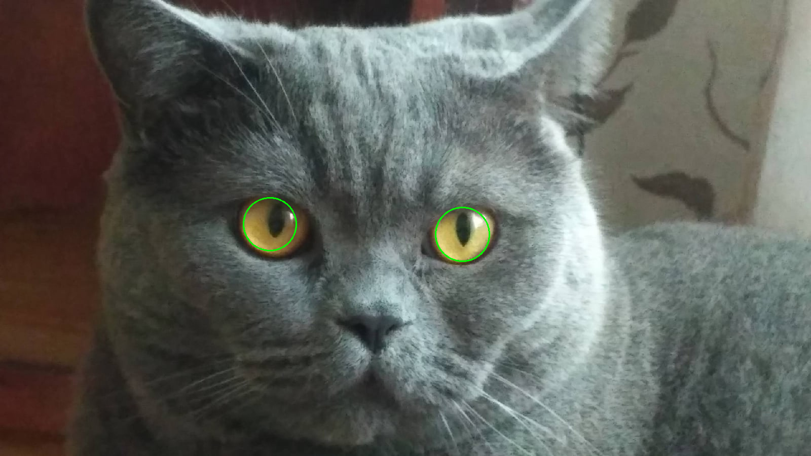

# Image processing homework

In this homework I implemented 5 image filters and search of circles using ***opencv*** and ***numpy*** libraries.

## Description

Original images are located in ***data*** directory. Processed images are saved into ***images*** directory.

### Filters


### Circle detection




## Usage

### Download source code and install dependencies

```
git clone https://github.com/krglkvrmn/BI_2020-2021_Python.git
cd BI_2020-2021_Python/images_homework
pip install -r requirements.txt
```

### Launch script

```bash
python filters.py data/<any_image>
```
