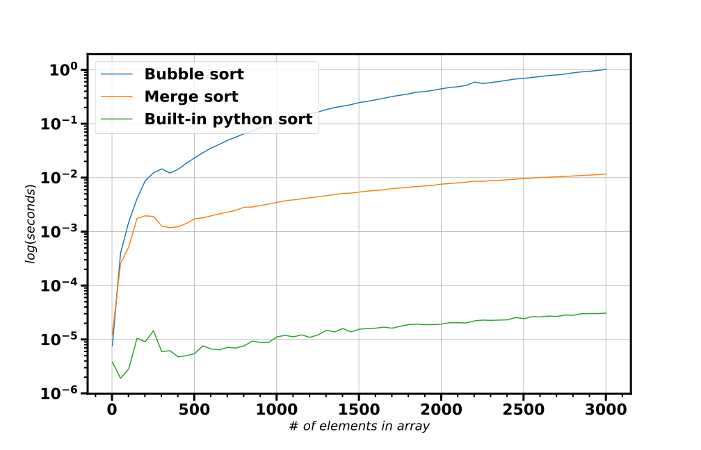
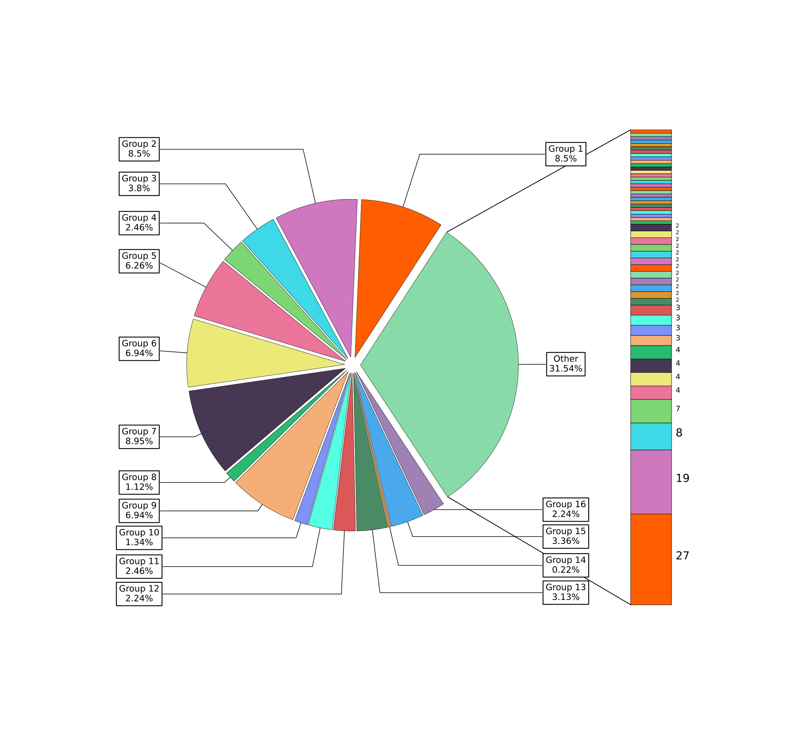

# Visualization homework

These scripts cover basics of data visualization using *matplotlib.pyplot* and *seaborn* as well as some advanced chart customization.

## Description

#### Simple line plot

Simple plot which is drawn with *matplotlib.pyplot* and shows comparison of different sorting algorithms.



#### Length distribution of fasta file

Histogram shows how many sequences of particular length are located in fasta file. Chart is drawn with *seaborn*.


#### Volcano plot

Commonly used way to represent gene expression data. Plot is drawn with *matplotlib.pyplot*.


#### "Bar of pie"

This chart is a way of representing relative size of some groups. Drawing this chart requires relatively

deep immersion into some aspects of *matplotlib*. 

Note that "Pie" and "Bar" are drawn separately and then joined together with external editor. Implementation of such joint within code is possible, but can significantly raise it's complexity and lower reusability.



## Usage

### Download source code and install dependencies

```bash
git clone https://github.com/krglkvrmn/BI_2020-2021_Python.git
cd BI_2020-2021_Python/visualization_homework
pip install -r requirements.txt
```

### Launch jupyter notebook

```bash
jupyter notebook Plots.ipynb
# or
jupyter lab Plots.ipynb
```

